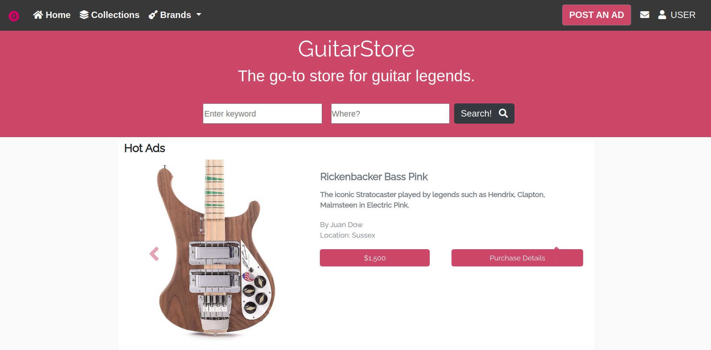

# GuitarStore

The first Capstone Project for the Microverse FullStack program.
This is a Guitar Store website based on the [Zattix](https://www.behance.net/gallery/24796463/ZATTIX) design 
originally created by [Mohammed Awad](https://www.behance.net/M_Awad) on [Behance](https://www.behance.net/).

This implementation follows design specifications such as color, fonts and layout.

## Built With

- 
- 
- 
- 

## Live Demo

[Live Demo Link](https://pointerish.github.io/GuitarStore)

##  Getting Started

To run the code simply download the repository by either cloning it or 
downloading it as a zip file. Then use the browser to open the HTML file.

## Author

**Josias Alvarado**

- GitHub: [@pointerish](https://github.com/pointerish)
- Twitter: [@pointerish](https://twitter.com/pointerish)
- LinkedIn: [Josias Alvarado](https://www.linkedin.com/in/josias-alvarado-80901878/)

##  Contributing

Contributions and issues are welcome!

## Show your support

Give a ⭐️ if you like this project!

## License

This project is [CC0-1.0](./LICENSE) licensed.

## Acknowledgements

- [Microverse](https://microverse.org)
- [Mohammed Awad](https://www.behance.net/M_Awad)
- [Behance](https://www.behance.net/)
- [Sass](https://sass-lang.com/)
- [Bootstrap](https://getbootstrap.com/) and its creators